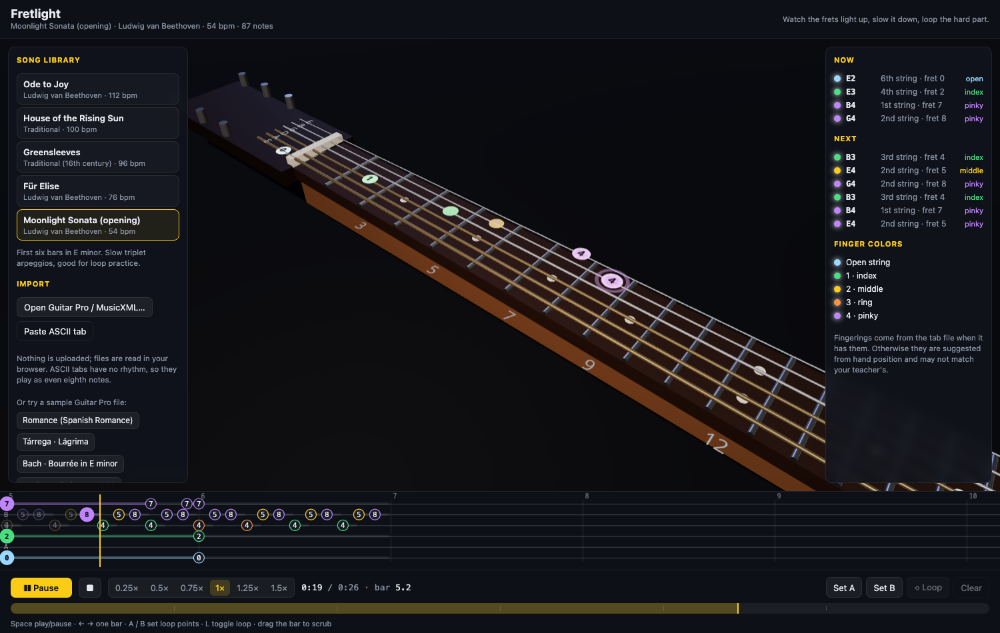

# Fretlight + Tone Lab

Two guitar learning apps in one repo. **Fretlight** (at `/`) teaches songs, scales, licks, and chords on a 3D neck. **Tone Lab** (at `/tone/`) teaches how guitar tone is built: a pedalboard you hear, see, and take apart.

# Fretlight

Learn songs on a 3D guitar neck. Pick a song, press play, and watch the frets light up where your fingers go, in time with the music. Slow it down, scrub, and loop the bars you are stuck on.



The audio is synthesized in the browser with a plucked-string model (Karplus-Strong), so there are no recordings to license and nothing to download.

## What it does

- **3D fretboard** built procedurally with correct fret spacing. Four camera presets: lap view (as if the guitar is on your knee), neck close-up, teacher view, and top down. Drag to orbit, scroll to zoom.
- **Fret lights** colored by finger: blue open, green index, yellow middle, orange ring, purple pinky. Upcoming notes fade in up to two beats early.
- **Scrolling tab strip** under the 3D view with fret numbers approaching a playhead.
- **Transport**: play/pause, speeds from 0.25x to 1.5x, bar-snapped A/B loop, scrub bar, keyboard shortcuts (Space, arrows, A, B, L).
- **Song library** of public domain pieces: Ode to Joy, House of the Rising Sun, Greensleeves, Für Elise, Moonlight Sonata.
- **Learn tab**: a five-course curriculum (Foundations, Scales and Keys, Harmony, Technique, Styles), 18 lessons, 73 steps. Every step loads something onto the neck and plays it: interval pairs, triads and inversions, scale positions with the key lit, modes over a drone, progressions with the current chord's tones lit, seventh chords, picking and legato drills with the speed trainer, sweep shapes, strum patterns, and blues, rock, and shred vocabulary. Includes a note-naming drill. Progress is saved in the browser.
- **Instruments**: pick what the notes sound like from the 🎸 menu in the transport. Clean, crunch, and distorted electric (clean samples through a built-in overdrive, amp, and cabinet), the General MIDI overdriven and distortion guitars, jazz electric, steel-string and nylon acoustics, or the original plucked-string synth. Samples download per note on demand (about 20 KB each) and are cached. Your choice is remembered.
- **Neck overlays**: Key (every in-key note, roots highlighted) or Chord tones (root, third, fifth of the chord playing right now, following the song's sections).
- **Practice tab** with a scale builder: any root, 13 scales and modes, 3-note-per-string positions, pentatonic boxes and CAGED-style windows, one-string runs, and picking patterns (up/down, groups of 3 and 4, thirds, string skipping) at any note value and tempo. Exercises loop by default.
- **Speed trainer**: add a few bpm every time the loop wraps until a ceiling, plus a metronome click and a one-bar count-in.
- **Licks and warm-ups** written in the app's tab notation: blues, rock, classic-rock player styles, country, metal, shred, and warm-ups, mostly in A around the 5th position.
- **Chords**: a chord explorer (any root, nine qualities, open shapes with barre fallbacks) and a progression builder with presets (pop, 50s, 12-bar blues, ii–V–I, Andalusian, and more) in any key, eight strum and picking patterns, and editable chord slots. Each chord becomes a section chip you can loop.
- **Routine builder**: chain songs, exercises, licks, and progressions with minutes per step. It plays each step on a loop and auto-advances with a countdown banner. Saved in the browser, with a 20-minute starter routine.
- **Key and chord overlay** (toggle in View): detects the song's key, lights every in-key fret on the neck with roots highlighted, and prints detected chord names above the tab strip.
- **Section markers** from Guitar Pro files (intro, solo, outro) appear as chips in the transport. Click one to loop that section.
- **Articulations** in the model, the synth, the 3D neck, and the tab strip: bends (the string visibly pushes sideways, pitch glides), slides (the marker travels along the string), vibrato (the string shimmers), hammer-ons and pull-offs (linked markers, no pick attack), tapping, palm mute, and let ring. Imported Guitar Pro files bring their own articulations in.
- **Import** Guitar Pro files (.gp3, .gp4, .gp5, .gpx, .gp) and MusicXML via [alphaTab](https://www.alphatab.net/), with a track picker for multi-track files. Files are parsed in the browser and never uploaded. Seven sample classical guitar files are bundled.
- **Paste ASCII tab** as a best-effort import. ASCII tabs have no rhythm, so each column plays as an eighth note.
- **Shareable links**: `?song=<id>&at=<beat>&view=lap|neck|front|top&play=1`.

# Tone Lab

Live at `/tone/`. A signal chain simulator with lessons.

- **A guitar stage first in every chain**: pickup selector (neck, middle, bridge modelled as comb filtering), volume knob (a gain into everything after it, so a driven amp cleans up when you roll back), and tone knob.
- **16 effects and amps** built from Web Audio nodes: clean boost, noise gate, compressor, overdrive (soft clip), distortion (hard clip), fuzz (asymmetric), 3-band EQ, wah/auto-wah, chorus, phaser, tremolo, delay with dark repeats, convolution reverb with synthesized rooms, a four-model amp with two cascaded gain stages, inter-stage filtering, power-supply sag, tone stack and presence, and a speaker cabinet with mic position and mic distance (a synthesized room impulse response).
- **3D pedalboard**: drag a pedal along the board to reorder it, drag a knob up or down to turn it, click the footswitch to bypass, LEDs and cable pulses follow the signal. The chain editor under the board does the same with drag-and-drop cards, arrows, power, and remove buttons.
- **Scopes**: waveform and spectrum of the dry guitar (grey) against the selected pedal's output (yellow), plus the clipping curve of any drive stage or amp.
- **Sources**: six built-in riffs (clean arpeggios, power chords, blues lick, funk stabs, slow melody, metal gallop) played by a plucked-string synth, or your own guitar through the mic or an audio interface.
- **Ear training**: "Which pedal?" hides one effect in front of a clean amp and asks you to name it; "What changed?" moves one knob on your own chain and has you flip A/B to find it.
- **Save and share**: save chains in the browser, or copy a link that carries the whole chain in the URL.
- **Delay tap tempo** with quarter, dotted eighth, eighth, triplet, and sixteenth buttons computed from the riff tempo or your taps. **Hold to hear without it** on any pedal. Mic mode shows an input meter and a tuner.
- **Twelve lessons**: signal chain order, gain staging, overdrive vs distortion vs fuzz, EQ and the mids, compression, modulation, delay, reverb, amp and cab, your guitar as the first pedal, recording the amp, and building the classics. Each step loads a chain and a riff and gives you one thing to turn.
- **Sixteen tone recipes** described by ingredients: clean sparkle, blues crunch, classic rock lead, 80s chorus, modern metal, ambient swells, country twang, dotted-eighth delay, woolly fuzz, wall of shimmer, surf, jazz box, grunge, stoner doom, volume-knob swells, funk rhythm.
- **A/B bypass** to hear the dry guitar against the chain at any moment.

Tone Lab lives entirely in `src/tone/` with its own entry (`tone/index.html`) and shares no code with Fretlight, so it can be moved to its own repo by copying that folder and the entry.

## Run it

```sh
npm install
npm run dev
```

Build for production with `npm run build`; the output is a static site in `dist/`.

## Deploy to Vercel

Vite is auto-detected, so no configuration is needed.

```sh
npm i -g vercel
vercel login
vercel          # first run links the directory to a new Vercel project and deploys a preview
vercel --prod   # production deploy
```

Or import the GitHub repo from the Vercel dashboard and every push deploys.

## Tab notation for licks and songs

Songs and licks are written as text, one voice at a time, in `src/model/tabdsl.ts` format:

```
1/8b2:q 1/5:e 2/8 2/5 3/7 3/5 4/7~:h
```

`string/fret`, then articulations (`b2` full bend, `b1` half, `b2r` bend and release, `s9` slide to 9, `h` hammer or pull, `t` tap, `~` vibrato, `m` palm mute, `l` let ring, `f3` finger), then `:duration` (`w h q e s t x` or a number of beats, add `.` for dotted). Strings use tab numbering: 1 is the high e. Chords join with `+`.

## Project layout

- `src/model/` song data model, the small text DSL used to author bundled songs, and the fingering heuristic.
- `src/songs/` bundled arrangements.
- `src/exercises/` the scale/shape/pattern generator and the hand-written licks library.
- `src/scene/articulation.ts` bend, slide, and vibrato geometry for the markers.
- `src/audio/synth.ts` Karplus-Strong synth.
- `src/player/transport.ts` song clock, note scheduler, loop logic.
- `src/import/` Guitar Pro / MusicXML importer (alphaTab) and the ASCII tab parser.
- `src/scene/` react-three-fiber guitar, marker pool, camera presets.
- `src/ui/` panels, transport bar, tab strip.

## Audio credits

Guitar samples in `public/sf/` are rendered from the FluidR3_GM SoundFont (Frank Wen, Creative Commons Attribution 3.0) via Benjamin Gleitzman's [midi-js-soundfonts](https://github.com/gleitz/midi-js-soundfonts). Crunch and distorted tones are those clean samples through an in-app amp simulation.

## Notes on the bundled sample files

The compositions in `public/samples/` are public domain. The Guitar Pro transcriptions came from gprotab.net (user uploads, no stated license) and the alphaTab website (MPL-2.0). Replace them with your own files if that matters for your use.
